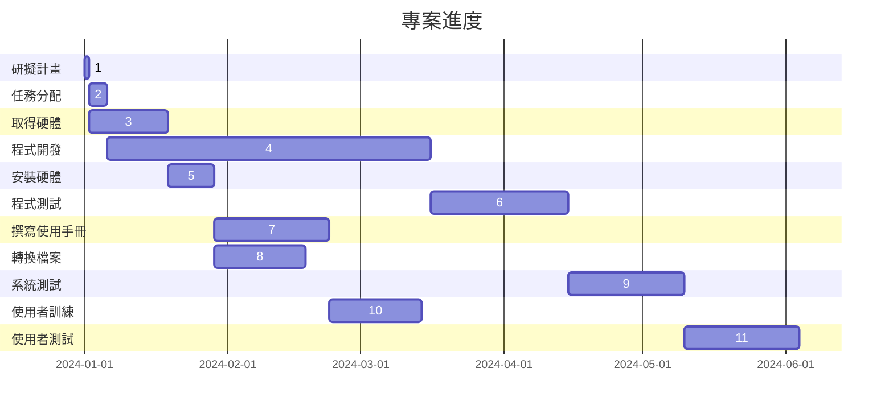
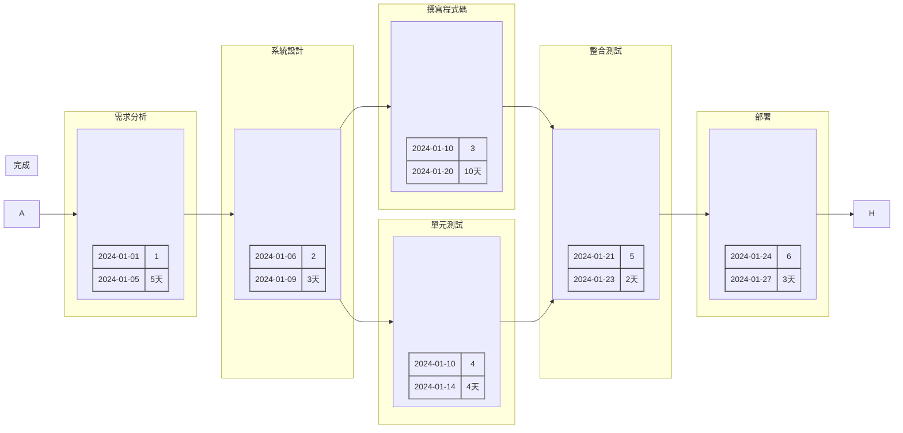

### hw2

    
任務名稱 1

    <table border="1" cellspacing="0" cellpadding="10" style="width: auto; display: inline-table;">
        <tr>
            <td style="text-align: center;">開始時間: 2024-01-01</td>
            <td style="text-align: center;">任務編號: 1</td>
        </tr>
        <tr>
            <td style="text-align: center;">結束時間: 2024-01-05</td>
            <td style="text-align: center;">需求時間: 5天</td>
        </tr>
    </table>
    &#8594;

    
任務名稱 2

    <table border="1" cellspacing="0" cellpadding="10" style="width: auto; display: inline-table;">
        <tr>
            <td style="text-align: center;">開始時間: 2024-01-06</td>
            <td style="text-align: center;">任務編號: 2</td>
        </tr>
        <tr>
            <td style="text-align: center;">結束時間: 2024-01-10</td>
            <td style="text-align: center;">需求時間: 4天</td>
        </tr>
    </table>
    &#8594;

    
任務名稱 3

    <table border="1" cellspacing="0" cellpadding="10" style="width: auto; display: inline-table;">
        <tr>
            <td style="text-align: center;">開始時間: 2024-01-11</td>
            <td style="text-align: center;">任務編號: 3</td>
        </tr>
        <tr>
            <td style="text-align: center;">結束時間: 2024-01-15</td>
            <td style="text-align: center;">需求時間: 4天</td>
        </tr>
    </table>
    &#8594;

    
任務名稱 4

    <table border="1" cellspacing="0" cellpadding="10" style="width: auto; display: inline-table;">
        <tr>
            <td style="text-align: center;">開始時間: 2024-01-16</td>
            <td style="text-align: center;">任務編號: 4</td>
        </tr>
        <tr>
            <td style="text-align: center;">結束時間: 2024-01-20</td>
            <td style="text-align: center;">需求時間: 5天</td>
        </tr>
    </table>
    &#8594;

    
任務名稱 5

    <table border="1" cellspacing="0" cellpadding="10" style="width: auto; display: inline-table;">
        <tr>
            <td style="text-align: center;">開始時間: 2024-01-21</td>
            <td style="text-align: center;">任務編號: 5</td>
        </tr>
        <tr>
            <td style="text-align: center;">結束時間: 2024-01-25</td>
            <td style="text-align: center;">需求時間: 5天</td>
        </tr>
    </table>

<table border="1" cellspacing="0" cellpadding="10" style="width: 100%;">
    <tr>
        <td colspan="2" style="text-align: center; font-size: 20px;">大方格</td>
    </tr>
    <tr>
        <td style="text-align: center;">1</td>
        <td style="text-align: center;">2</td>
    </tr>
    <tr>
        <td style="text-align: center;">3</td>
        <td style="text-align: center;">4</td>
    </tr>
</table>
